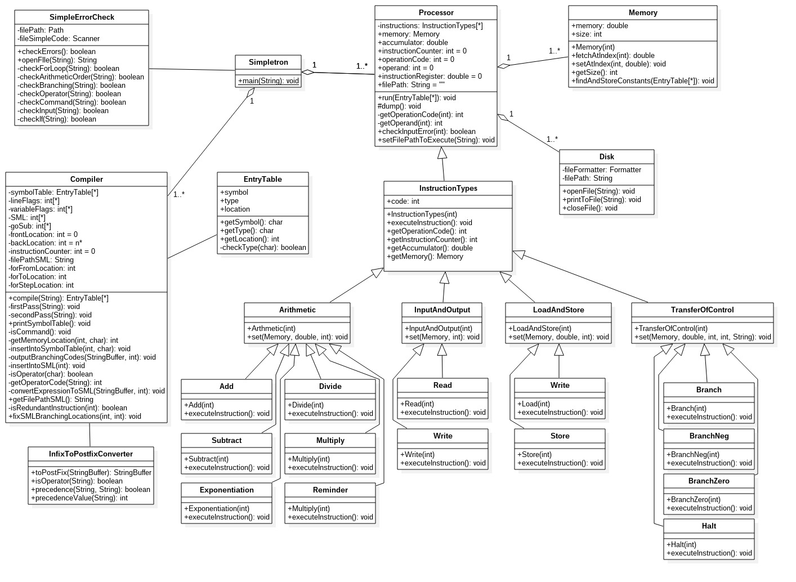
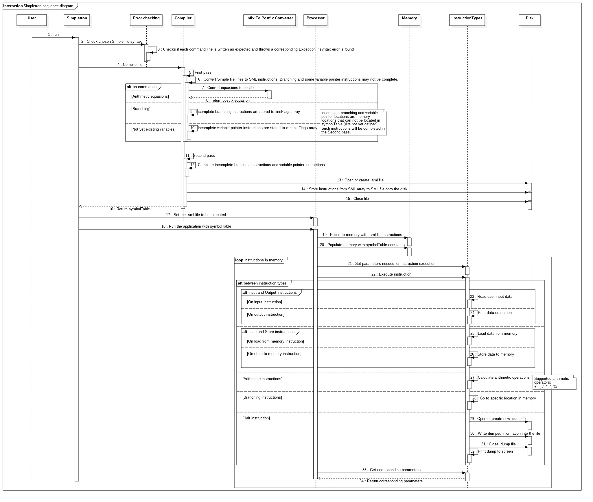
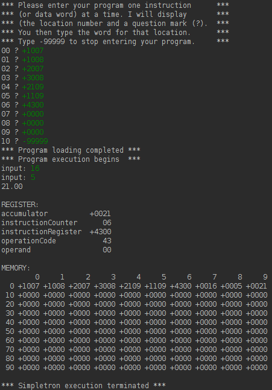

# [Simpletron](Simpletron.java)
Simulation of a virtual machine runs a **Compiler** to compile **Simple language** to **Simpletron Machine Language** which is then executed with help of virtual hardware components written object-oriented using [polymorphism](https://en.wikipedia.org/wiki/Polymorphism_(computer_science)).

Simple language files `.simple` are located in the folder `simplefiles` and Simpletron Machine Language files `.sml` are located in the folder `simpletronhardware/SML` together with `.dump` files.

## Diagrams
### Class Diagram

### Sequence Diagram

# Compiler simulation
Compiles Simple code to Simpletron Machine Language which runs on [Simpletron machine].

## RULES of Simple Language Syntax
Every **statement** constists of a **line number** and a **command** followed by command specific syntax.
### rem 
or *remark* is ignored by the compiler: 
```
10 rem next line is input
```
### input
followed by a one character variable name: 
```
11 input a
```
Asks user to input a number.

### let
has more options: 
```
12 let a
```
Declares variable `a` to 0. 
```
13 let a = 1
```
Declares variable `a` to 1. 
```
14 let a = b + c
```
Declers variable `a` to a sum of `b` and `c`. 
```
15 let a = b + (c - 2) * 10
```
Declares variable `a` to the result of `b + (c - 2) * 10`.

### goto
Followed by a line number redirects to that line number: `16 goto 10` moves to line 10,
### if
followed by a condition and a **goto** command, if the condition is **true** `goto` command is executed: `if x == 0 goto 10`
### for
followed by a \*variable declaration\* followed by a **to** keyword followed by a \*number\*. Optional followed by a **step** keyword followed by a \*number*\: 
```
for x = 1 to 10
print x
next
```
The example executes 10 times everything that is between a `for` line and a `next` line, this example prints the value `x`, each in a new line resulting in a count 1-10 inclusive.
```
for x = 1 to 10 step 2
print x
next
```
Same as previous example but it executes 5 times, `step` declares the number to be added to `x` on each loop.
### gosub
followed by a **line number**: `gosub 12` moves to the line 12 and executes following lines until keyword `return` is not found, then returns to the line after `gosub 12`. This command acts like a method call:
 ```
 10 let x = 2
 11 let y = 3
 12 gosub 30
 13 print r
 15 end
 30 let r = x + y
 31 return
 ```
The above example moves to line line 30 and calculates a value of `r` variable then returns back to line 13 and prints the value to the screen.

## Arithmetic Expressions 
are allowed to use only the following operators and have the same precedence as in Java, parentheses can be used to change the order of evaluation of the expression:
* Addition (**+**)
* Subtraction (**\-**)
* Multiplication (**\***)
* Division (**/**)
* Reminder (**%**)
* Exponentiation (**^**)

## Other Rules
 * **Line numbers** must be in ascending order,
 * Simple recognizes all case letters as *lowercase letters*,
 * A **variable name** is a **single letter**,
 * Simple allowes numbers from range -9999 to 9999 inclusive,
 * Simple does not allow string manipulation.

# Simpletron Machine Language
Simulation of how machine executes programs written in SML.
### Operation Codes
<table>
    <th>
        <td>Code</td>
        <td>Operation</td>
        <td>Description</td>
    </th>
    <tr>
        <td></td>
        <td>10</td>
        <td>READ</td>
        <td>Read a word from the keyboard into a specific location in memory.</td>
    </tr>
    <tr>
        <td></td>
        <td>11</td>
        <td>WRITE</td>
        <td>Write a word from a specific location in memory to the screen.</td>
    </tr>
    <tr>
        <td></td>
        <td>20</td>
        <td>LOAD</td>
        <td>Load a word from a specific location in memory into the accumulator.</td>
    </tr>
    <tr>
        <td></td>
        <td>21</td>
        <td>STORE</td>
        <td>Store a word from the accumulator into a specific location in memory</td>
    </tr>
    <tr>
        <td></td>
        <td>30</td>
        <td>ADD</td>
        <td>Add a word from a specific location in memory to the word in the accumulator (leave the result in the accumulator).</td>
    </tr>
    <tr>
        <td></td>
        <td>31</td>
        <td>SUBTRACT</td>
        <td>Subtract a word from a specific location in memory from the word in the accumulator (leave the result in the accumulator).</td>
    </tr>
    <tr>
        <td></td>
        <td>32</td>
        <td>DIVIDE</td>
        <td>Divide a word from a specific location in memory into the word in the accumulator (leave result in the accumulator).</td>
    </tr>
    <tr>
        <td></td>
        <td>33</td>
        <td>MULTIPLY</td>
        <td>Multiply a word from a specific location in memory by the word in the accumulator (leave the result in the accumulator).</td>
    </tr>
    <tr>
        <td></td>
        <td>34</td>
        <td>REMINDER</td>
        <td>Calculate a reminder of a word in the accumulator by the word from a specific location in memory by the(leave the result in the accumulator).</td>
    </tr>
    <tr>
        <td></td>
        <td>35</td>
        <td>EXPONENTIATION</td>
        <td>The word in the accumulator to the power of a word from a specific location in memory(leave the result in the accumulator).</td>
    </tr>
    <tr>
        <td></td>
        <td>40</td>
        <td>BRANCH</td>
        <td>Branch to a specific location in memory.</td>
    </tr>
    <tr>
        <td></td>
        <td>41</td>
        <td>BRANCHNEG</td>
        <td>Branch to a specific location in memory if the accumulator is negative.</td>
    </tr>
    <tr>
        <td></td>
        <td>42</td>
        <td>BRANCHZERO</td>
        <td>Branch to a specific location in memory if the accumulator is zero.</td>
    </tr>
    <tr>
        <td></td>
        <td>43</td>
        <td>HALT</td>
        <td>Halt. The program has completed its task.</td>
    </tr>
</table>

### Summing Two Numbers
First we feed the computer the instructions which lead it to run an application that sums up two numbers.
<table>
    <th>
        <td>Location</td>
        <td>Number</td>
        <td>Instruction</td>
    </th>
    <tr>
        <td></td>
        <td>00</td>
        <td>+1007</td>
        <td>(Read A into memory 07)</td>
    </tr>
    <tr>
        <td></td>
        <td>01</td>
        <td>+1008</td>
        <td>(Read B into memory 08)</td>
    </tr>
    <tr>
        <td></td>
        <td>02</td>
        <td>+2007</td>
        <td>(Load A from memory 07)</td>
    </tr>
    <tr>
        <td></td>
        <td>03</td>
        <td>+3008</td>
        <td>(Add B)</td>
    </tr>
    <tr>
        <td></td>
        <td>04</td>
        <td>+2109</td>
        <td>(Store C to memory 09)</td>
    </tr>
    <tr>
        <td></td>
        <td>05</td>
        <td>+1109</td>
        <td>(Write to line from memory 09)</td>
    </tr>
    <tr>
        <td></td>
        <td>06</td>
        <td>+4300</td>
        <td>(Halt execution)</td>
    </tr>
    <tr>
        <td></td>
        <td>07</td>
        <td>+0000</td>
        <td>(Reserved memory for A)</td>
    </tr>
    <tr>
        <td></td>
        <td>08</td>
        <td>+0000</td>
        <td>(Reserved memory for B)</td>
    </tr>
    <tr>
        <td></td>
        <td>09</td>
        <td>+0000</td>
        <td>(Reserved memory for C)</td>
    </tr>
</table>

After computation is finished and application is halted it prints or dumps its register and memory to display.

