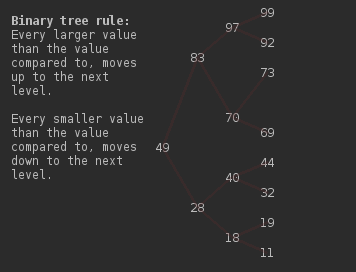

# Custom Generic Data Structures
## [Binary Tree](BinaryTreeDeletion.java)
### What is binary tree and how does it work?
Binary tree is a tree-like storage structure which always separates into two branches. 
Usual direction of the tree is from top to bottom.

First value in the tree is called root. The second value inserted in the tree is compared to the root (or parent) and if its less than then its stored to roots (or parents) left side otherwise its stored to the right side. This value then becomes a child of the root and a parent to the new possible inputs. 

Graphical demonstration:

## [Binary Tree Of Integers](BinaryTreeOfIntegers.java)
Binary tree of integers demonstrates the input of integers (first line), its depth, inorder traversal, preorder traversal and postorder traversal.

## [Binary Tree Of Strings](BinaryTreeOfIntegers.java)
Binary tree of strings is the same demonstration as with integers but with strings.

## [Indexed List](IndexedList.java)
Indexed list is a list stored under indexes to provide better performance when searching for a value.

## [Infix To Postfix Converter](InfixToPostfixConverter.java)
Infix to postfix converter is an application that converts a human readable arithmetic expression into machine-language code using a Stack.

## [Insert Into Ordered List](InsertIntoOrderedList.java)
Demonstration of inserting and merging into an ordered list

## [Reverse Copy](ReverseCopy.java)

## [Search List](SearchList.java)
Searches a list, outputs the number if found and null if not found.

## [Stack Palindrome](StackPalindrome.java)
Uses a Stack to determine if an input is a palindrome or not.

## [Supermarket Simulation](SupermarketSimulation.java)
Using Queue it simulates a supermarket checkout line with 1-4 min arrival of a new customer and 1-4 min service time of current customer for 720 min or 12 hours.

