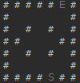

<h1>Recursion</h1><h5>from Deitel Java 8 exercises</h5>

In this section I was working on challenges:

<h3><a title="Recursion Main" href="Recursion.java">Recursion.java</h3>
<ol>
<li><a title="Power of X" href="Power.java">Power of X</a>: First argument raised to the power of second argument</li>
<li><a title="Palindromes" href="Palindrome.java">Palindromes:</a> Is the string a palindrome? Ignores case, white space and punctation.</li>
<li><a title="Eight Queens " href="EightQueens.java">Eight Queens:</a> Can eight queens be placed into a 8x8 field without attacking each other?</li>
<li><a title="Print an array" href="PrintAnArray.java">Print an array:</a> Prints integer array as-is, minimum value of integer array, and reversed string input</li>
</ol>
<h3><a title="Maze Traversal with Recursive Backtracking" href="MazeMain.java">MazeMain.java</a></h3>
<ul>
<li><a title="Maze Traversal with Recursive Backtracking" href="MazeTraversalBacktracking.java">Maze Traversal with Recursive Backtracking</a>: Maze generator with solution</li>
</ul>
<h2>Demonstrational images</h2>

File Recursion.java:  Output is self-explanatory

File MazeMain.java:  
  
LEGEND:
<ol>
<li><b>#</b> represents a Wall</li>
<li><b>Empty field</b> represents a Corridor</li>
<li><b>+</b> represents a active path</li>
<li><b>-</b> represents a backtracked path</li>
</ol>

<h3>Future work</h3>

There is still alot of possibilities to improve the performance and functionality of the program. 
For now known issues:
<ul>
<li>Maze is sometimes generated in many diagonal corridors, I prefer horizontal and vertical corridors,</li>
<li>Smallest maze that can be generated with this logic is of size 7x7,</li>
<li>Direction of movement is always decided in the order Up, Right, Down and Left,</li>
<li>It would be better if it would not run into a blind corridor which is smaller than 3 in-a-row fields.</li>
</ul>
 
Example of a maze with only horizontal and vertical corridors

