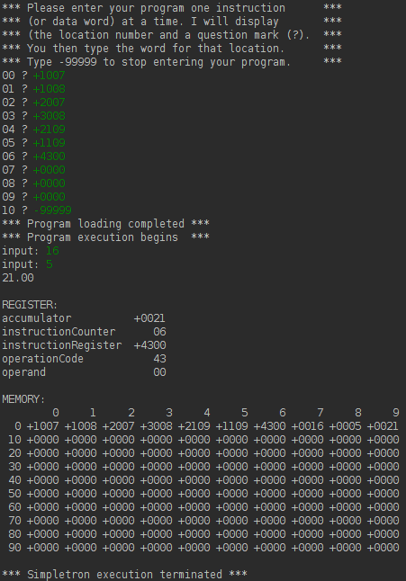

# Simpletron Machine-Language Programming
An exercise to create a programming language simulator called Simpletron Machine Language or SML.
The compiler should be written object-oriented.
## RULES
There are certain rules that the Simple needs to follow:
<ul>
<li>Every <i>statement</i> consists of a <i>line number</i> and a <i>instruction</i>:
    <ul><li><i>Line numbers</i> must appear in <i>ascending</i> order,</li>
        <li>Each <i>statement</i> begins with the following <i>commands</i>:
            <ul>
                <li><b>rem</b> is a remark that represents a comment and is ignored by the compiler - can be used multiple times,</li>
                <li><b>input</b> reads a value inputed from the keyboard and save to the following variable - can be used multiple times,</li>
                <li><b>let</b> declares a variable and sets its value - can be used multiple times,</li>
                <li><b>print</b> prints variables value - can be used multiple times,</li>
                <li><b>goto</b> moves to the following line e.g. <i>goto 10' moves to line 10</i> - can be used multiple times,</li>
                <li><b>if/goto</b> is a conditional expression e.g. <i>if i == 5 goto 10</i> - can be used multiple times,</li>
                <li><b>end</b> terminates the program, only one <i>end</i> command per code allowed.</li>
            </ul>
        </li>
        <li><i>Arithmetic expressions</i> are allowed to use only following <i>operators</i> and have the same <i>precedence</i> as in <i>Java</i>, however <i>parentheses</i> can be used to change the <i>order of evaluation</i> of the expression:
            <ul>
                <li>+</li>
                <li>-</li>
                <li>*</li>
                <li>/</li>
            </ul>
        </li>
        <li>Simple recognizes only <i>lowercase letters</i>,</li>
        <li>A <i>variable name</i> is a single letter,</li>
        <li>Simple does not allow string manipulation.</li>
    </ul>
</li>
<li><li>
</ul>
## Progress
Completed:
<ul>
<li>Simple programs: programs that are written in Simple language,</li>
<li>Error checking methods for Simple program files</li>
</ul>
Open:
<ul>
<li>Compiler: needs to compile Simple code into SML instructions as introduced in <i>Operation codes</i> and <i>Summing up 2 numbers</i></li>
</ul>
### Operation codes
<table>
    <th>
        <td>Operation code</td>
        <td>Operation</td>
        <td>Description</td>
    </th>
    <tr>
        <td></td>
        <td>10</td>
        <td>READ</td>
        <td>Read a word from the keyboard into a specific location in memory.</td>
    </tr>
    <tr>
        <td></td>
        <td>11</td>
        <td>WRITE</td>
        <td>Write a word from a specific location in memory to the screen.</td>
    </tr>
    <tr>
        <td></td>
        <td>20</td>
        <td>LOAD</td>
        <td>Load a word from a specific location in memory into the accumulator.</td>
    </tr>
    <tr>
        <td></td>
        <td>21</td>
        <td>STORE</td>
        <td>Store a word from the accumulator into a specific location in memory</td>
    </tr>
    <tr>
        <td></td>
        <td>30</td>
        <td>ADD</td>
        <td>Add a word from a specific location in memory to the word in the accumulator (leave the result in the accumulator).</td>
    </tr>
    <tr>
        <td></td>
        <td>31</td>
        <td>SUBTRACT</td>
        <td>Subtract a word from a specific location in memory from the word in the accumulator (leave the result in the accumulator).</td>
    </tr>
    <tr>
        <td></td>
        <td>32</td>
        <td>DIVIDE</td>
        <td>Divide a word from a specific location in memory into the word in the accumulator (leave result in the accumulator).</td>
    </tr>
    <tr>
        <td></td>
        <td>33</td>
        <td>MULTIPLY</td>
        <td>Multiply a word from a specific location in memory by the word in the accumulator (leave the result in the accumulator).</td>
    </tr>
    <tr>
        <td></td>
        <td>40</td>
        <td>BRANCH</td>
        <td>Branch to a specific location in memory.</td>
    </tr>
    <tr>
        <td></td>
        <td>41</td>
        <td>BRANCHNEG</td>
        <td>Branch to a specific location in memory if the accumulator is negative.</td>
    </tr>
    <tr>
        <td></td>
        <td>42</td>
        <td>BRANCHZERO</td>
        <td>Branch to a specific location in memory if the accumulator is zero.</td>
    </tr>
    <tr>
        <td></td>
        <td>43</td>
        <td>HALT</td>
        <td>Halt. The program has completed its task.</td>
    </tr>
</table>

### Summing up 2 numbers
First we feed the computer the instructions which lead it to run an application that sums up two numbers.
<table>
    <th>
        <td>Location</td>
        <td>Number</td>
        <td>Instruction</td>
    </th>
    <tr>
        <td></td>
        <td>00</td>
        <td>+1007</td>
        <td>(Read A into memory 07)</td>
    </tr>
    <tr>
        <td></td>
        <td>01</td>
        <td>+1008</td>
        <td>(Read B into memory 08)</td>
    </tr>
    <tr>
        <td></td>
        <td>02</td>
        <td>+2007</td>
        <td>(Load A from memory 07)</td>
    </tr>
    <tr>
        <td></td>
        <td>03</td>
        <td>+3008</td>
        <td>(Add B)</td>
    </tr>
    <tr>
        <td></td>
        <td>04</td>
        <td>+2109</td>
        <td>(Store C to memory 09)</td>
    </tr>
    <tr>
        <td></td>
        <td>05</td>
        <td>+1109</td>
        <td>(Write to line from memory 09)</td>
    </tr>
    <tr>
        <td></td>
        <td>06</td>
        <td>+4300</td>
        <td>(Halt execution)</td>
    </tr>
    <tr>
        <td></td>
        <td>07</td>
        <td>+0000</td>
        <td>(Reserved memory for A)</td>
    </tr>
    <tr>
        <td></td>
        <td>08</td>
        <td>+0000</td>
        <td>(Reserved memory for B)</td>
    </tr>
    <tr>
        <td></td>
        <td>09</td>
        <td>+0000</td>
        <td>(Reserved memory for C)</td>
    </tr>
</table>

After computation is finished and application is halted it prints or dumps its register and memory to display.
